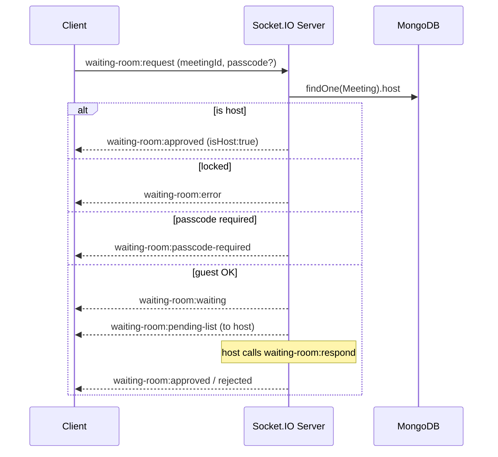

<div align="center">

# 🎥 RealTimeMeet

### Mesh-Topology WebRTC Video Conferencing — Server-Verified Host Authority, JWT-Gated Waiting Rooms & a Live Collaborative Whiteboard

*A production-grade full-stack real-time platform built on the MERN stack + Socket.IO + WebRTC*

[**🌐 Live Demo**](https://realtimemeet.up.railway.app/) &nbsp;•&nbsp; [**💻 Source Code**](https://github.com/Ahmadmalik1122/CodeAlpha_RealTimeMeet) &nbsp;•&nbsp; [**🐛 Report Bug**](https://github.com/Ahmadmalik1122/CodeAlpha_RealTimeMeet/issues) &nbsp;•&nbsp; [**✨ Request Feature**](https://github.com/Ahmadmalik1122/CodeAlpha_RealTimeMeet/issues)

<br/>


</div>

<br/>

> [!NOTE]
> RealTimeMeet is not a video-SDK wrapper. Signaling, host authority, waiting-room admission, and the collaborative whiteboard are all hand-built and re-verified server-side — nothing security-relevant is trusted from the client.

---

## 📚 Table of Contents

- [Overview](#-overview)
- [Architecture](#-architecture)
- [Feature Deep-Dive](#-feature-deep-dive)
- [Technology Stack](#-technology-stack)
- [Project Structure](#-project-structure)
- [API Surface](#-api-surface)
- [Local Development](#-local-development)
- [Security Notes](#-security-notes)
- [Roadmap](#-roadmap)
- [Author](#-author)

---

## ✨ Overview

RealTimeMeet pairs a **React 19 / Vite** client with an **Express 5** API and a **Socket.IO** real-time layer. Media flows peer-to-peer over **WebRTC in a mesh topology** — every participant holds a direct `RTCPeerConnection` to every other participant. Socket.IO is used purely for **signaling, presence, and application events**; it never touches the media stream itself.

<table>
<tr>
<td width="33%" valign="top">

### 🛡️ Server-Verified Authority
Host status is resolved once per socket by checking `Meeting.host` in MongoDB against the JWT-decoded user id — never a client-sent flag.

</td>
<td width="33%" valign="top">

### 🚪 Live-Enforced Waiting Room
Locks, passcodes, kicks, and admission are enforced against an in-memory security cache mirrored to Mongo on every mutation.

</td>
<td width="33%" valign="top">

### 🖊️ Real Collaborative Whiteboard
Full stroke history replays to late joiners; per-stroke undo/redo keeps every connected board in lockstep.

</td>
</tr>
</table>

## 🚀 Live Application

<div align="center">

| 🌐 Demo | 💻 Source |
|:---:|:---:|
| [realtimemeet.up.railway.app](https://realtimemeet.up.railway.app/) | [github.com/Ahmadmalik1122/CodeAlpha_RealTimeMeet](https://github.com/Ahmadmalik1122/CodeAlpha_RealTimeMeet) |

</div>

---

## 🧠 Architecture

```
┌──────────────────────────────┐
│          React 19 Client       │
│   Vite · Tailwind 4 · Firebase Auth SDK
└──────────────┬─────────────────┘
               │
   ┌───────────┼───────────────────┐
   │  REST (axios, JWT bearer)      │  WebSocket handshake
   │                                  │  auth: { token }
┌──▼──────────────────────────┐    │
│      Express 5 API             │    │
│  authRoutes · userRoutes       │    │
│  meetingRoutes · uploadRoutes  │    │
│  feedbackRoutes                │    │
└──┬──────────────┬─────────────┘    │
   │              │                    │
   │ Mongoose     │ Firebase Admin     │
┌──▼───────┐  ┌───▼─────────┐   ┌────▼────────────────────────┐
│ MongoDB   │  │  Firebase    │   │      Socket.IO Server         │
│ • User    │  │  (Google     │   │  JWT middleware on handshake   │
│ • Meeting │  │   login      │   │  → socket.userId               │
│ • History │  │   verify)    │   │  in-memory room / security /   │
│ • Feedback│  └──────────────┘   │  waiting-room state             │
└───────────┘                     └──┬──────────────────────┬─────┘
                                      │                       │
                              signaling only          direct P2P media
                                      │                       │
                            ┌─────────▼─────────┐   ┌─────────▼─────────┐
                            │   Peer signaling    │   │    WebRTC Mesh      │
                            │  offer / answer /    │   │  one RTCPeer-        │
                            │  ICE candidate relay │   │  Connection per      │
                            └──────────────────────┘   │  participant pair    │
                                                        └───────────────────────┘
```

> **Why mesh over SFU?** The server only relays `sending-signal` / `returning-signal` / `ice-candidate` payloads by socket id — it never decodes or forwards media. That keeps the backend media-agnostic (no MCU/SFU infra to operate) at the cost of client bandwidth scaling with room size — a deliberate tradeoff for small-to-medium meetings.

---

## 🔥 Feature Deep-Dive

### 🔐 Authentication & Identity
- Email/password registration with `bcryptjs` hashing + JWT issuance
- **Google Sign-In** via Firebase Auth on the client, verified server-side with `firebase-admin`
- Verification & reset tokens stored as **SHA-256 hashes only** — a DB leak can never be replayed
- Cooldown-throttled resend/forgot-password endpoints to stop mail-spraying
- `authMiddleware` JWT guard on every mutating route

### ⚡ Real-Time Meeting Engine


- **Host-only security controls** — lock/unlock, bcrypt passcode, disable chat, disable screen share, kick — every one independently re-verified server-side
- **Live presence**: mic / camera / screen-share / raised-hand tracked per-socket, broadcast on change, full snapshot sent to new joiners
- **Reactions & raised hands** — ephemeral, never persisted
- **Chat** with typing indicators + read receipts, host-gated
- **Whiteboard** — capped 5,000-segment history, replayed to late joiners, strokeId-scoped undo/redo

### 🗓️ Meeting Lifecycle & History
Unique meeting IDs, Mongo-backed `Meeting` records, and a separate `MeetingHistory` collection that best-effort logs join/leave and closes out duration + status — never blocking the live socket path.

### 👤 Profile, Preferences & Settings
| Category | Fields |
|---|---|
| **Meeting prefs** | camera/mic/speaker device IDs, join-with-camera/mic defaults, layout (`grid` / `speaker` / `sidebar`) |
| **Appearance** | theme, accent color, font size |
| **Notifications** | reminders, chat, reactions, email, desktop, join/leave — 6 independent toggles |

### 💬 Feedback
Dedicated `Feedback` model + REST route for in-app product feedback.

---

## 🧰 Technology Stack

<div align="center">

| Layer | Technology |
|:---|:---|
| 🎨 Frontend | React 19.2 · Vite · Tailwind CSS 4 · React Router 7 |
| 🌐 HTTP / Realtime client | Axios · Socket.IO Client 4.8 |
| 🔑 Client auth | Firebase 12 (Google Sign-In) |
| 🖼️ UI helpers | lucide-react · qrcode.react |
| ⚙️ Backend | Node.js ≥ 18.18 · Express 5.1 |
| 🗄️ Database | MongoDB · Mongoose 8 |
| 🔒 Server auth | JWT (`jsonwebtoken`) · `bcryptjs` · `firebase-admin` |
| 📡 Realtime server | Socket.IO 4.8 |
| 🎥 Media transport | WebRTC (browser-native, mesh) |
| ✉️ Email | Nodemailer · Resend |
| 📁 Uploads | Multer |
| ✅ Validation | validator |
| 🚂 Deployment | Railway |

</div>

---

## 📁 Project Structure

```
CodeAlpha_RealTimeMeet/
├── client/
│   └── src/
│       ├── components/
│       ├── context/          # Auth / global React context
│       ├── firebase/         # Firebase client SDK config
│       ├── hooks/            # useWebRTC, useMediaDevices, useBrowserNotifications
│       ├── pages/            # Login, Register, Dashboard, MeetingRoom, Settings, Activity, Feedback
│       ├── services/         # API + socket client wrappers
│       ├── socket/
│       └── utils/
│
├── server/
│   ├── config/                # DB connection, CORS allowlist
│   ├── controllers/           # auth, verification, passwordReset, meeting, feedback, upload
│   ├── middleware/             # authMiddleware (JWT guard)
│   ├── models/                 # User, Meeting, MeetingHistory, Feedback
│   ├── routes/                 # authRoutes, userRoutes, meetingRoutes, uploadRoutes, feedbackRoutes
│   ├── scripts/                 # backfillVerified.js
│   ├── services/                 # meetingHistoryService, mail/verification services
│   ├── socket/                    # socket.js — the entire real-time engine
│   ├── uploads/
│   └── app.js
│
└── render.yaml
```

---

## 🔌 API Surface

<details open>
<summary><strong>REST Endpoints</strong></summary>

<br/>

| Method | Route | Auth | Purpose |
|:---|:---|:---:|:---|
| `POST` | `/api/auth/register` | — | Create a local account |
| `POST` | `/api/auth/login` | — | Email/password login |
| `POST` | `/api/auth/google-login` | — | Verify Firebase ID token, create/login |
| `GET` | `/api/auth/verify-email/:token` | — | Consume verification token |
| `POST` | `/api/auth/resend-verification` | — | Resend (cooldown-throttled) |
| `POST` | `/api/auth/forgot-password` | — | Request reset email |
| `GET` | `/api/auth/reset-password/:token` | — | Check reset link validity |
| `POST` | `/api/auth/reset-password/:token` | — | Perform reset |
| `GET`/`PUT` | `/api/auth/profile` | 🔒 | Read / update profile |
| `PUT` | `/api/auth/change-password` | 🔒 | Change password |
| `POST` | `/api/meetings/create` | 🔒 | Create a meeting |
| `POST` | `/api/meetings/join` | 🔒 | Join by meeting ID |
| `GET` | `/api/meetings/history` | 🔒 | List past meetings |
| `DELETE` | `/api/meetings/history` | 🔒 | Clear history |
| `*` | `/api/upload/*` | 🔒 | Multer profile-picture upload |
| `*` | `/api/feedback/*` | 🔒 | Submit feedback |

</details>

<details>
<summary><strong>Socket.IO Events</strong></summary>

<br/>

| Event | Direction | Purpose |
|:---|:---:|:---|
| `join-room` / `all-users` / `user-joined` / `user-left` | ↔ | Room presence |
| `waiting-room:request/approved/rejected/waiting/pending-list/cancel/respond` | ↔ | Gated entry flow |
| `security:set-lock/set-passcode/set-chat-disabled/set-screenshare-disabled/kick/state` | host → server → room | Host controls |
| `sending-signal` / `returning-signal` / `ice-candidate` | client ↔ client (relayed) | WebRTC negotiation |
| `media-state-changed` / `screen-share-changed` / `raise-hand` / `reaction` | broadcast | Presence state |
| `whiteboard-draw/open/clear/undo/redo/history` | broadcast | Collaborative whiteboard |
| `send-message` / `receive-message` / `typing` / `chat-read` | broadcast | In-meeting chat |

</details>

---

## ⚙️ Local Development

### 1️⃣ Clone

```bash
git clone https://github.com/Ahmadmalik1122/CodeAlpha_RealTimeMeet.git
cd CodeAlpha_RealTimeMeet
```

### 2️⃣ Backend

```bash
cd server
npm install
```

Create `server/.env` (see `server/.env.example`):

```env
PORT=5000
MONGODB_URI=your_mongodb_connection_string
JWT_SECRET=your_long_random_jwt_secret
CLIENT_URL=http://localhost:5173

SMTP_HOST=smtp.gmail.com
SMTP_PORT=587
SMTP_USER=your_email@gmail.com
SMTP_PASS=your_gmail_app_password
RESEND_API_KEY=your_resend_api_key
MAIL_FROM="RealTimeMeet <your_email@gmail.com>"

FIREBASE_PROJECT_ID=your_firebase_project_id
FIREBASE_CLIENT_EMAIL=your_firebase_service_account_email
FIREBASE_PRIVATE_KEY=your_firebase_service_account_private_key
```

```bash
npm start    # node app.js
npm run dev   # nodemon app.js
```

### 3️⃣ Frontend

```bash
cd client
npm install
```

Create `client/.env`:

```env
VITE_API_URL=http://localhost:5000/api
VITE_SOCKET_URL=http://localhost:5000
VITE_FIREBASE_API_KEY=...
VITE_FIREBASE_AUTH_DOMAIN=...
VITE_FIREBASE_PROJECT_ID=...
```

```bash
npm run dev
```

➡️ App runs at **http://localhost:5173**

---

## 🔒 Security Notes

> [!IMPORTANT]
> - Never commit `.env` files, DB credentials, JWT secrets, SMTP/Resend keys, or Firebase service-account keys. Rotate immediately if exposed.
> - Verification & reset tokens are stored as **SHA-256 hashes only** (`select: false`) — the raw token exists solely in the outbound email.
> - Every privileged socket event re-derives host authority server-side from `Meeting.host` + JWT-verified `socket.userId`. Client-side `isHost` is UI convenience, not a trust boundary.
> - Kicked users are tracked by user id so they can't simply reconnect with a fresh socket — a known limitation is that a kicked *guest* with no account can start a new anonymous session.

---

## 📈 Roadmap

- [ ] 🎬 Meeting recording
- [ ] 🧑‍🤝‍🧑 Participant management panel (mute-all, spotlight)
- [ ] 🌐 TURN server config for restrictive NAT/firewalls
- [ ] 📅 Calendar integration
- [ ] 🧪 Automated test suite + CI/CD pipeline
- [ ] 🪄 Background blur / virtual backgrounds

---

## 👨‍💻 Author

<div align="center">

**Muhammad Ahmad**
Software Engineering Student · MNS UET Multan

[](https://github.com/Ahmadmalik1122)
[](https://www.linkedin.com/in/muhammad-ahmad-en)

</div>

## 📄 License

Available for educational and portfolio purposes.

---

<div align="center">

**⭐ If you found RealTimeMeet useful, consider starring the repository.**

*Built with ❤️ using React, Node.js, MongoDB, Socket.IO & WebRTC.*

</div>
